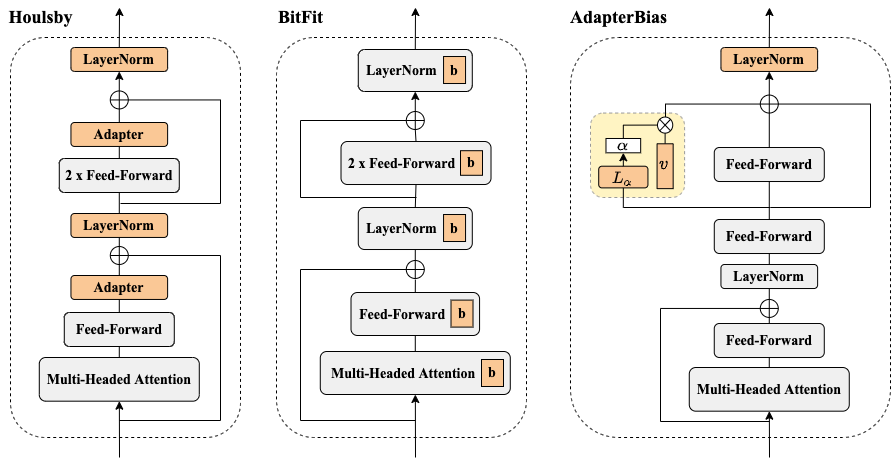

# AdapterBias: Parameter-efficient Token-dependent Representation Shift for Adapters in NLP Tasks


[](https://img.shields.io/badge/Version-v0.1.0-blue)
[](https://opensource.org/licenses/MIT)
[](https://github.com/huggingface/transformers)


arXiv link: upcoming

To be published in [**Findings of NAACL 2022**](https://2022.naacl.org/)

Authors:
[Chin-Lun Fu*](https://www.linkedin.com/in/chin-lun-fu-201612219/), 
[Zih-Ching Chen*](https://www.linkedin.com/in/zih-ching-chen-7158111b0/),
[Yun-Ru Lee](https://www.facebook.com/profile.php?id=100002026928166),
[Hung-yi Lee](https://speech.ee.ntu.edu.tw/~hylee/index.php)

## Overview


In this study, AdapterBias, a surprisingly simple yet effective adapter architecture, is proposed.
AdapterBias adds a token-dependent shift to the hidden output of transformer layers to adapt to downstream tasks with only a vector and a linear layer.

### Dataset

We use [GLUE Benchmark](https://gluebenchmark.com/) as our dataset. You can download all datasets from the website.

### Training

```
cd src
python exp.py \
    --adapter True \
    --GLUE_path <ur_GLUE_path> \
    --output_path <output_path> \
    --model <model name> \
    --task <the task u want to run> \
    --epoch 100 \
    --lr 0.0001 \
    --max_len 512 \
    --batch_size 32 \
```

- `-s` or `--seed` specifies the random seed
- `-g` or `--GLUE_path` specifies the path of your GLUE dataset.
- `-o` or `--output_path` specifies the path of saved model and saved predicted file.
- `-m` or `--model` specifies the pre-trained language model (PLM) you used in training.
    - Some examples: `bert-base`, `bert-large`, `roberta-base`, `roberta-large`
- `-t` or `--task` specifies the downstream task.
    - Some examples: `cola`, `mnli`, `qnli`, `qqp`, `mrpc`, `rte`, `sst`, `sts` 
- `-a` or `--adapter` specifies whether you adding our AdapterBias in PLM
- `--share_alpha` specifies whether you share the same alpha in AdapterBias in all transformer layers

### Inference

After you run the training, you can automatically get the prediction file in <output_path>/result/. Also, the saved model is in <output_path>/model/.

Running all nine tasks of GLUE benchmark, you can sumbit the prediction files to the [website](https://gluebenchmark.com/).
